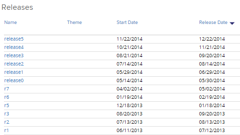
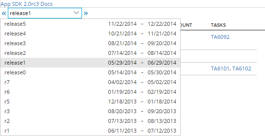
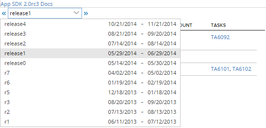

Remove Future Releases from Combobox
=========================

## Overview
This is an app example that shows how to limit releases in the combobox by ReleaseStartDate.
If releses in the project include a future release as shown below:

the default behavior of the combobox is to inlcude the future release:

Here is a screenshot of the same release combobox after the code was modified to filter by Releases where the ReleaseStartDate is less than or equal to today.

release5 is no longer listed:

This app is available AS IS. It is not supported by Rally support.
## License

AppTemplate is released under the MIT license.  See the file [LICENSE](./LICENSE) for the full text.

##Documentation for SDK

You can find the documentation on our help [site.](https://help.rallydev.com/apps/2.0rc3/doc/)
